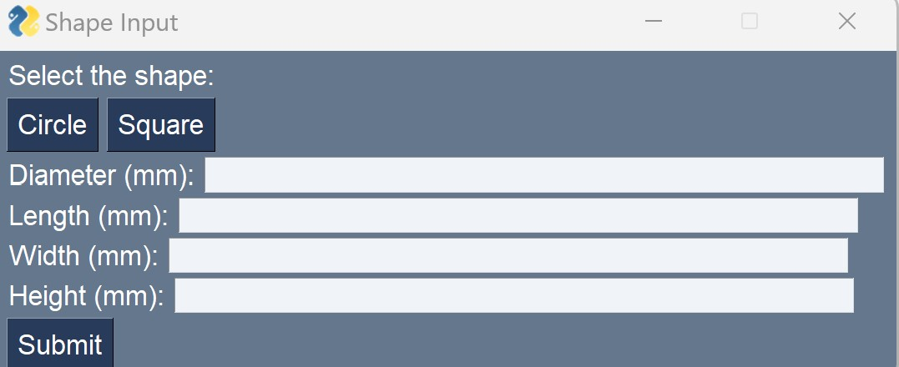

# LJX Python SPEC Stage Command Generation

#### Functional python scripts  and SPEC macros that generate stage positions and scan commands, execute stage movement and scans and read raw laser data.

This part of the project serves the purpose of integrating laser communication into the motor control software 'SPEC'. The raw data collected using these scripts will be formatted into a 3D point cloud of data points in the 3DModel.py script. The SPEC integration scripts will consist of 2 python scripts and 1 SPEC macro called SPEC_Commands.py, 3DScan.py and KeyenceSpecOutput.mac respectively. 

The SPEC_Commands.py script requires user input of general dimensions and qualities of the part to be scanned. It will then output two text files called SPEC_SIZE.txt and SPEC.txt. The SPEC_SIZE.txt file defines the number of rows in the SPEC.txt file and the SPEC.txt file defines the motor positions, the scan flag and the rotation flag. The SPEC_SIZE.txt file is required because SPEC must know the size of a text file it reads in prior to reding it in.

The KeyenceSpecOutput.mac macro defines 2 SPEC functions called 'readsize' and 'laserscan'. The 'readsize' function reads in the SPEC_SIZE.txt file to define a global variable of the number of rows in the SPEC.txt file. The 'laserscan' function reads the SPEC.txt file, moves the motors to each position and checks if the scan flag is 0 or 1. If the scan flag is 0, the next motor position is moved to, but when it reads 1, the 3DScan.py script is called on by SPEC to run.

The 3DScan.py script captures the raw data from a laser scan and appends the data to a KeyenceScan.txt file.

## More information relevant to this project:
* The python scripts use Python modules: PySimpleGUI, math, numpy, ctypes, sys and time.
* The scripts were written in Python 3.9.
* A Keyence LJ-X8080 profiling laser and LJ-X8000A controller were used with the scripts.

## User Instructuons
# SPEC_Commands.py:

The SPEC_Commands.py script is located in the "PYTHON" folder. Prior to executing the script, rewrite the staging configuration settings to match your hardware configuration.

```
#########################################
# CHANGE THIS BLOCK TO MATCH STAGE LIMITS
#########################################
```
The parameters to be rewritten include:
* __[x_min,X_max]__: The upper and lower limits of the staging's x motors (account for backlash).
* __[y_min,y_max]__: The upper and lower limits of the staging's y motors (account for backlash).
* __[z_min,z_max]__: The upper and lower limits of the staging's z motors (account for backlash).
* __x_steps__: The number of measuremnts desired per mm in the direction of the x motor (cannot exceed the steps per mm of the motor itself).
* __y_steps__: The number of measuremnts desired per mm in the direction of the y motor (cannot exceed the steps per mm of the motor istelf).
* __phi_steps__: The number of measurements desired per degree in the motor of roation (cannot exceed the steps per degree of the motor itself).
* __[stage_x,stage_y]__: The dimensions of the stage in the directions of the x and y motors (mm).
* __center_dist__: The distance between the laser and the center of roation on the stage (mm).
* __stage_rot__: Variable that defines if positive rotation of the stage is clockwise (0) or counterclockwise (1).
* __motor_parallel__: Variable that defines which motor moves the stage towards the laser (parallel), x(0) or y(1).
* __motor_parallel_0__: Variable that defines which direction of the 'parallel' motor moves the stage towards the laser, negative(0) or positive(1).
* __laser_dist__: Variable that defines how far in mm the laser is from the center of rotation and in what direction when defining the referenve point as the laser facing the stage, left(-) or right(+).
* __motor_parallel_90__: Variable that defines which direction moves the stage towards the laser of the other motor when the stage is rotated positively 90 degrees, negative(0) or positive(1).

To execute this script and generate the SPEC_SIZE.txt file and SPEC.txt file, run with a compiler or type the following when in the PYTHON directory with python installed:
```
$ python SPEC_Commands.py
```

The user will be prompted to enter genral dimensions and qualities of the part.


Once ran, the script will geberate the text files in the working directory of the python script.


# KeyenceSpecOutput.mac:

The KeyenceSpecOutput.mac macro is located in the "PYTHON' folder. This macro can be run in SPEC using the following commands:

```
$[SPEC] qdo ./KeyenceSpecOutput
```

```
$[SPEC] readsize SPEC_SIZE.txt
```

```
$[SPEC] laserscan SPEC.txt
```

# 3Dscan.py:
The 3DScan.py script is located in the "PYTHON" folder. This script does not require any configuraton but will be called on to run by the KeyenceSpecOutput.mac macro. The macro will output 4 raw data file beginning with 'KeyenceScan'. Rename the 4 files before running the macro again so as not to append more data to a file containing old scan data.

## License Agreement
Please review the software license agreement at the end of the README.pdf file located in the /License folder of the main branch.
