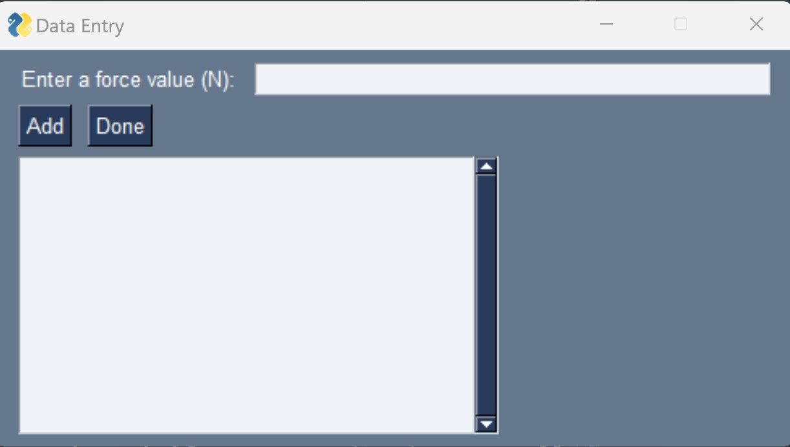
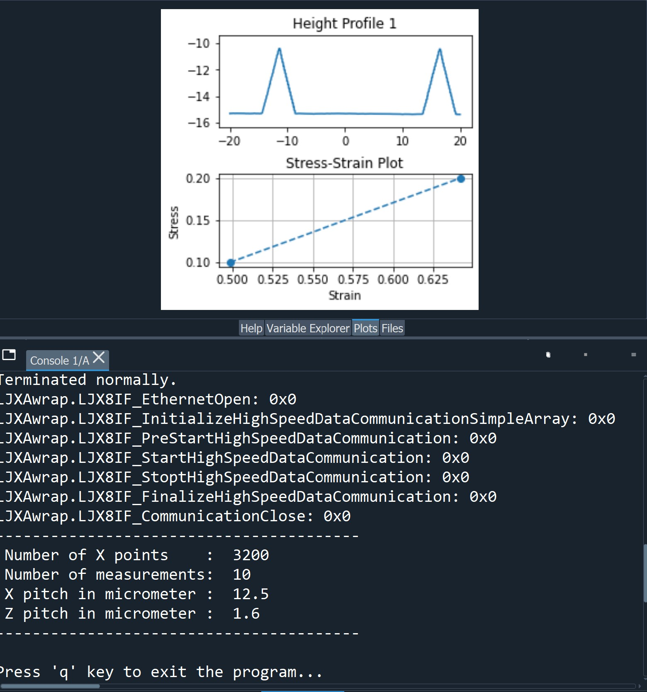

# LJX Python Strain Acquisition Project

#### Functional python script that communicates with a Keyence LJ-X8000A controller to acquire stress and strain data of sample using a Keyence profiling laser.

This project was developed to determine if strain could be measured using a profiling laser. This script communicates with the profiling laser to generate stress and strain data and graphs based on user input force data and the cross-sectional area of the specimen being strained. 

For this project, a Keyence profiling laser and controller were used to collect data. Since all first party software compatible with the LJ-X8000A controller (LJ-X Navigator and LJ-X Observer) are only compatible with Windows operating systems, a python script was written to complete the goals of this project. To use this script, a library of communication files and an LJXAWrap.py python script must be acquired from Keyence. These files allow compatibility with both Windows and Linux operating systems and contain all the necessary functions required to communicate with the LJ-X8000A controller. Please note this script is not usable without the functions from the wrapper script and associated files. Reaching out to Keyence is required to properly obtain the communication files.

## More information relevant to this project:
* This script uses the Python modules: LJXAwrap, ctypes, sys, time, numpy, matplotlib, modeling from astropy and PySimpleGUI (install with pip and requires Python 3.4+)
* The script was written with Python 3.9.
* A Keyence LJ-X8080 profiling laser was used with this script.
* This script is only compatible with a LJ-X8000A controller.
* To communicate with another controller, different wrapper files may need to be obtained and this script may need to be altered.

## User Instructions
The program (ROUSSEAU_StrainAcquisition.py) is located in the "PYTHON" folder. Prior to executing the script, rewrite the sensor settings and specimen properties sections as desired.

```
###################################################
# CHANGE THIS BLOCK TO MATCH YOUR SAMPLE PROPERTIES
###################################################
```
```
###############################################
CHANGE THIS BLOCK TO MATCH YOUR SENSOR SETTINGS
###############################################
```

The parameters that should be rewritten include:
* __Gauge Length:__ Initial length of the specimen being scanned.
* __Cross Sectional Area:__ Cross-sectional area of the specimen being scanned.
* __Device ID:__ Identifier when using multiple heads.
* __IP Address/Port Number:__ Network settings for the LJ-X8000A controller.
* __Image Size in Y Direction:__ Number of profile lines to be acquired each scan.
* __Timeout:__ Time in seconds to acquire data before an error.


To execute this script and acquire strain data run the script using a compiler, or type the following when in the PYTHON directory.

```
$ python3 ROUSSEAU_StrainAcquisition.py
```

After the communication is established, the user will be prompted to input force data. Please note a strain measurement will only be taken each time the user inputs a force value. 



If no force data is available or only strain data is desired, arbitrary values can be inserted into the prompt. Otherwise, the script must be edited to exclude the prompt (note to self: maybe include a TRUE/FALSE condition to measure strain with or without force data).

This script measures strain by tracking the distance between 2 peaks. For example, this project used aluminum samples that had 2 short lengths of wire super glued to them at various distances (these wires represented the "peaks"). The script locates the absolute closest data point to the laser (or highest peak), and then locates the second highest data point at least 2 mm away from the first highest point. This means two assumptions are made:
1. The peaks or wires do not span a width wider than 2 mm.
2. The two peaks are at least 2 mm part.
The 2mm value can be changed as desired, but it works for the purposes of this experiment.

In order to ensure the same point on the peak is being tracked, the peak regions ( $\pm$ 2 mm) were isolated and given gaussian/normal distribution curves where the center of the peak was defined as the center/mean of the distribution. The strain was measured by tracking how the distance changed between the two centers. 

Each time a new force value is inserted into the prompt box, a profile plot and stress strain plot will be developed and the profile data with be amended to the Strain_Distance.txt file.



## License Agreement
Please review the software license agreement at the end of the README.pdf contained in the /License folder of the main branch.
